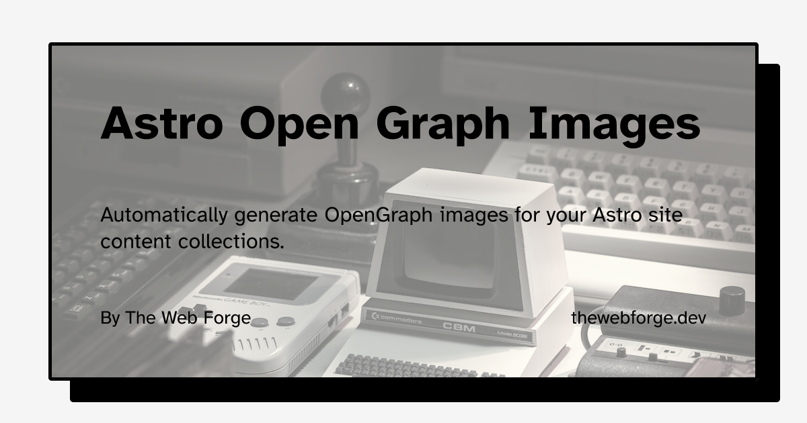

# @thewebforge/astro-og-images 🌠

This package generates OpenGraph images for your collection entries when you build your Astro site.

- <strong>[Why Astro OG images](#why-astro-og-images)</strong>
- <strong>[Installation](#installation)</strong>
- <strong>[Usage](#usage)</strong>
- <strong>[Configuration](#configuration)</strong>
- <strong>[Examples](#examples)</strong>
- <strong>[Contributing](#contributing)</strong>
- <strong>[Changelog](#changelog)</strong>

## Why Astro OG Images

Open Graph images, also known as OG images, are images that are specifically designed to be displayed when a webpage or content is shared on social media platforms like Facebook, Twitter, LinkedIn, and others. The Open Graph protocol is a set of meta tags that allows web developers to control how their web pages are presented when shared on social media.

When a link is shared on social media, the platform usually tries to generate a preview of the content by fetching information from the webpage. This preview typically includes a title, description, and an image. The Open Graph protocol provides a way for developers to define and optimize these elements for social sharing.

With @thewebforge/astro-og-images, you don't have to worry about creating these files: build your Astro site as you normally would, and the astro-og-images package will crawl your routes and create the Open Graph images file.

## Installation

First, install the `@thewebforge/astro-og-images` package using your package manager. If you're using npm or aren't sure, run this in the terminal:

```sh
npm i @thewebforge/astro-og-images
```

> **Warning**
> There a issues I still need to fix when using pnpm. For now, I recommend using npm or yarn.

You will need a JSX renderer for rendering Images templates. If you don't have one, you can install the `@astrojs/react` integration:

```sh
npx astro add react
```

## Usage

`@thewebforge/astro-og-images` will create an API endpoint to create your images.

To use it, create a folder in your project `pages` folder called `open-graph` or any other name you want. A folder with the same name will be generated at build time in your `dist` folder with all your open graph images.

In the folder you just created, create a file called `[...ogimage].ts` where `ogimage` is the name of the parameter you want to use to generate your images.

**`[...ogimage].ts`**

```ts
import { getCollection, CollectionEntry } from "astro:content";
import ogApi from "@thewebforge/astro-og-images";

const entries = await getCollection("blog");

export const { getStaticPaths, get } = ogApi({
  entries: entries,
  param: "ogimage",
  template: "simple",

  getImageOptions: async ({ id, data }: CollectionEntry<"blog">) => {
    return {
      path: id,
      title: {
        text: data.title,
      },
      description: { text: data.description },
    };
  },
});
```

Now, [build your site for production](https://docs.astro.build/en/reference/cli-reference/#astro-build) via the `astro build` command. You should find your opengraph images under `dist/open-graph`!

You will find the same folder structure as your `blog` folder. The images will have the same name(slug) with the `.png` extension.

After verifying that the open graph images are built, you can add them to your layout's `<head>`.

## Configuration

To configure this package, customize the returned object of the `getImageOptions()` function created in `[...ogimage].ts`.

**`[...ogimage].ts`**

```ts
import { getCollection } from "astro:content";

// Generate images for the services collection
const entries = await getCollection("services");

export const { getStaticPaths, get } = ogApi({
    ...
});
```

### `entries`

The entries you want to generate the images for. You can use the `getCollection()` function from `astro:content` to get your entries.

**`[...ogimage].ts`**

```ts
...
   entries: entries,
```

### `param`

The name of the parameter you want to use to generate your images.

**`[...ogimage].ts`**

```ts
...
   param: "ogimage", // must match the name of the file
```

### `template`

The name of the template you want to use to generate your images. You can use the default template `simple` or choose from the list:

- `bgPhoto`
- `branded`
- `eCommerce`
- `retro`
- `simple`
- `wave`

**`[...ogimage].ts`**

```ts
...
    template: "wave",
```

## Examples

### `bgPhoto`


### `branded`


### `eCommerce`


### `retro`


### `simple`


### `wave`

## Contributing

This package is maintained by Cédric / The Web Forge. You're welcome to submit an issue or PR!
